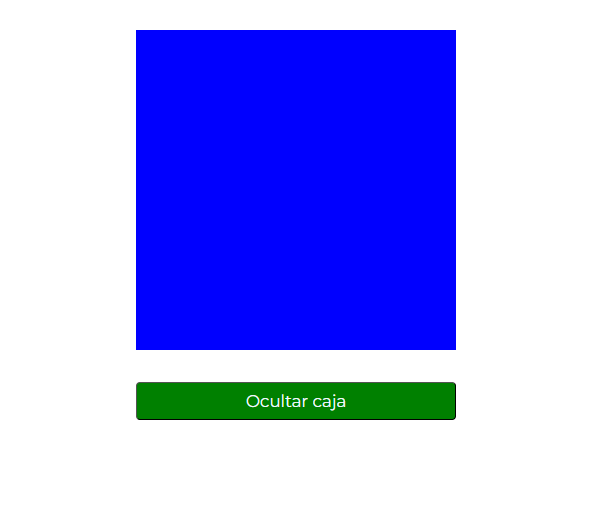
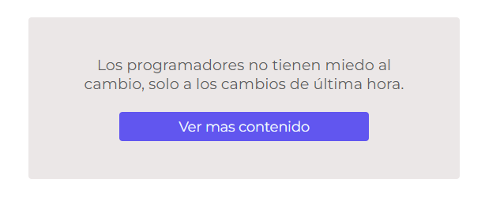
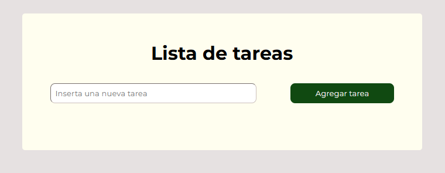
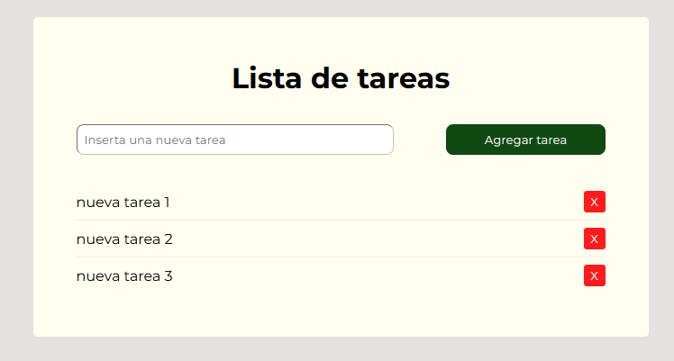
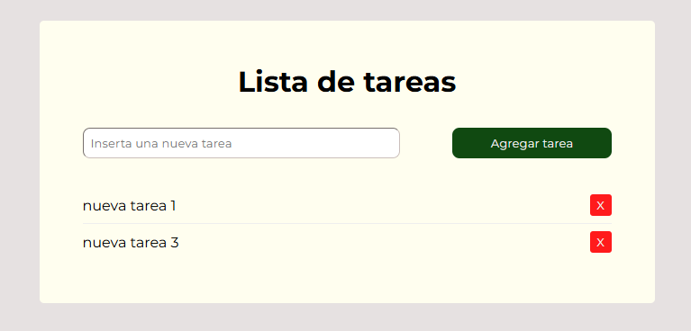
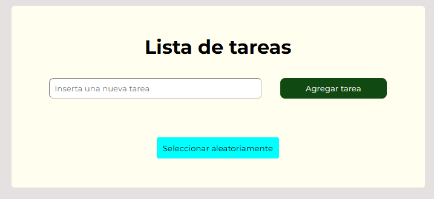
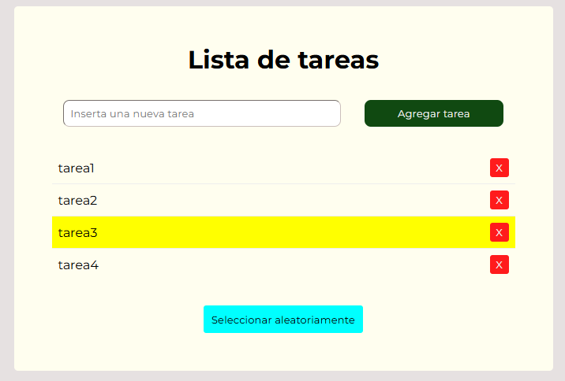
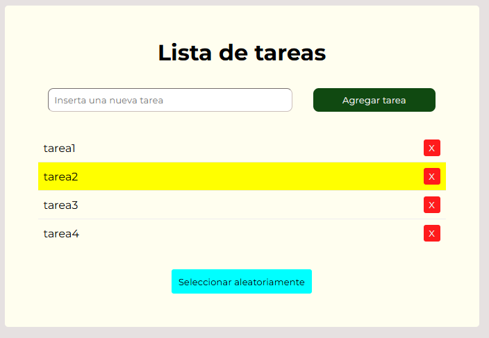
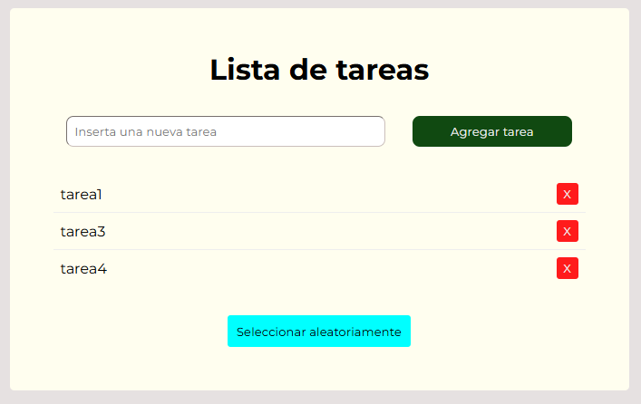

# Ejercicio de JavaScript DOM

## Proyecto 1: Accediendo, manipulando y creando elementos del DOM

En este primer proyecto vamos a practicar como acceder a los elementos de la página web, así como a crearlos y eliminarlos. 

Todos los ejercicios van a trabajar con una página modelo ya creada. Es página se encuentra en la carpeta actividades/Modelo dentro del github.

### Ejercicio 1
En la página web ves que tienes un titular **Hola Mundo**. Se trata de añadir una función javascript para que al pulsar el botón **cambiar** este título se convierta en **Hola Mundo con Javascript** . El unico cambio necesario es el bloque con el texto **cambiar** y  completar la función **cambiar()** que aparece en el código de la página.

Debe cambiar de **Hola Mundo** a **Hola Mundo Javascript**

### Ejercicio 2
Tienes la página web [modelo](https://www.aulascript.com/evaluar/dom_basico_modelo.html) que debe cambiar el color del titular del **negro** actual a **rojo** y además debe quedar centrado. El único cambio será en el bloque **cambiar** y el código de función **cambiar()**

El bloque cambiar acepta el click, el color del titular cambia a rojo y queda centrado

### Ejercicio 3
Escribe un script de nombre **creaDiv()** que crea un nuevo bloque div en la página modelo. El bloque se creará al pulsar el botón con texto **Crear**, sus colores serán texto blanco con fondo rojo y el texto quedará centrado. Este texto consiste en la cadena **Javascript permite crear páginas dinámicas**.

El botón ya existe solo es necesario escribir la función, procurando usar los métodos de document para crear nodos.

### Ejercicio 4
En la página web modelo debes lograr que al pulsar el botón con el texto **borrar** se deberá eliminar el bloque que aparece bajo el titular, no ocultar, sino borrarlo. Para detalles mira el código fuente de la página. Solo tienes que escribir el código de la función **borrar()**

Al pulsar el botón el subtítulo debe dejar de existir en el código de la página. No deb producirse error al volver a pulsar el botón.

### Ejercicio 5
La página web modelo contiene tres imágenes. Cada imagen está en un bloque **figure** con un elemento **figcaption** para un pie de foto. Al pulsar sobre cualquier imagen se debe mostar su atributo **alt** en su pie de foto. Si el pie ya está relleno se borrará su contenido y no se escribirá nada.

Cada imagen es como un botón que alterna el pie de foto entre vacio (sin texto) y el valor del atributo **alt** de cada una.

### Ejercicio 6
En este script debes leer todos los elementos tipo imagen de la página y mostrar sus **urls** en un bloque tipo div cuyo **id** es **fuentes** y que ya existe en la página modelo usada para estos ejercicios. El script se ejecutará al pulsar el botón con el texto **fuentes**

El bloque ya está creado solo tienes que crear la función denominada **fuentesImg()** asociada al botón fuentes

### Ejercicio 7
El script que tienes que crear en la página modelo debe cambiar la clase del elemento que contiene al encabezado de la página. Al pulsar sobre el titular se añadirá o se eliminarás (toggle) la clase de nombre **activo**

Tienes que modificar el botón **clase** y completar la función toggleClase() para producir este efecto.

### Ejercicio 8
Escribe el código de una función nuevoBloque() que deberá crear un nuevo elemento **div**, con una class de nombre **destacar**. El bloque contendrá, en negrita, el texto **Página Modelo**. Este bloque debe aparecer justo antes del bloque subtitulo es decir justo después del titular de la página. Se activará con el botón superior que contiene el texto **Subtitulo**

La función se llamara **intercalar()**

### Ejercicio 9
En la página modelo tienes un elemento div con un imagen en su interior. Cada vez que hagas click con el ratón sobre el la imagen cambiará.

El bloque tiene como clase **carrousel**. Dispones de tres imágenes: uno.png, dos.png y tres.png. Se deberán ir sucediendo en forma circular, despues de la última vuelve a la primera

### Ejercicio 10
El primer botón de la barra de botones en la parte superior de la página tiene el texto **abrir/cerrar**. Al pulsarlo se deben ocultar o mostrar los botones restantes, pero el de **abrir/cerrrar** debe quedar visible.

El valor de la propiedad display de los botones es **inline-block**. La barra tiene en el atributo class el valor **botones** y cada botón tiene como clase **boton**

## Proyecto 2: 

Implemente la funcionalidad en JavaScript para alternar la visibilidad de la caja al hacer clic en el botón.

**Pasos:**

* Crea una función llamada toggleBox que se activará al hacer clic en el botón. Esta función debe alternar la visibilidad de la caja cambiando el valor de la propiedad display entre 'none' y 'block'.
* La función también debe cambiar el texto del botón entre «Ocultar Caja» y «Mostrar Caja» según corresponda.
* Agrega un evento al botón para que llame a la función toggleBox cuando se haga clic en él.
* Verifica que el programa funcione correctamente. Al hacer clic en el botón, la caja debe desaparecer o aparecer según su estado actual, y el texto del botón debe cambiar en consecuencia.

## Proyecto 3:

Crea un contenedor que vaya mostrando frases de un array de forma aleatoria cuando el usuario interaccione con un botón. Tu objetivo es crear el código JavaScript para que cuando el usuario presione el botón aparezca una frase aleatoria del array frasesFrikisInformatica.

frasesFrikisInformatica = [
  "Los programadores no tienen errores, solo experiencias inesperadas.",
  "La programación es como montar en bicicleta: una vez que lo aprendes, nunca lo olvidas.",
  "En la informática, el único límite es la imaginación (y la memoria RAM).",
  "Los programadores no duermen, solo hacen pausas de ejecución.",
  "La mejor forma de resolver un problema es dividirlo en problemas más pequeños.",
  "Programar es como cocinar: a veces, una pizca de creatividad hace la diferencia.",
  "En la programación, cada punto y coma cuenta.",
  "El código es como el vino: mejora con el tiempo (y las revisiones).",
  "La resolución de problemas es la habilidad más importante en la programación.",
  "La informática es como una montaña rusa: emocionante y llena de giros inesperados.",
  "Los programadores no necesitan superpoderes, tienen lenguajes de programación.",
  "La programación es como un laberinto: a veces, tienes que retroceder para avanzar.",
  "Los buenos programadores piensan en código incluso cuando no están programando.",
  "La mejor parte de programar es el momento en que tu código finalmente funciona.",
  "La programación es como una conversación con el ordenador: tienes que hablar su idioma.",
  "Los programadores no comen errores, los depuran.",
  "La programación es como la música: cada línea de código es una nota en la sinfonía.",
  "La creatividad es la clave para resolver problemas de forma elegante en programación.",
  "En la informática, siempre hay una solución, solo necesitas encontrarla.",
  "Programar es como explorar un nuevo mundo, lleno de posibilidades infinitas.",
  "Los programadores no tienen miedo al cambio, solo a los cambios de última hora.",
  "La programación es como un juego de ajedrez: cada movimiento tiene consecuencias.",
  "Los bugs son como las malas hierbas: siempre aparecen cuando menos los esperas.",
  "La programación es como construir castillos de arena: a veces, el mar se lleva tu trabajo.",
  "Los programadores no inventan problemas, solo encuentran soluciones creativas.",
  "La informática es como la alquimia moderna: conviertes código en aplicaciones.",
  "La programación es como resolver un misterio: cada línea de código es una pista.",
  "Los programadores no tienen límites, solo desafíos que superar.",
  "La programación es como escribir poesía: cada palabra cuenta.",
  "Los mejores programas son los que hacen la vida más fácil.",
  "La programación es como un deporte: practica regularmente para mejorar.",
  "La curiosidad es la mejor amiga del programador.",
  "La programación es como una obra de arte: cada línea de código es una pincelada.",
  "Los buenos programadores escriben código legible para humanos, no solo para máquinas.",
  "La programación es como jugar con LEGO: construyes cosas increíbles con pequeñas piezas.",
  "La creatividad es la esencia de la programación: cada problema tiene múltiples soluciones.",
  "La programación es como viajar por el espacio: exploras nuevos mundos de posibilidades.",
  "Los programadores no hacen magia, ¡hacen código!",
  "La programación es como una montaña rusa: llena de altibajos emocionantes.",
  "En la programación, cada error es una oportunidad para mejorar.",
  "La programación es como una partida de ajedrez: cada jugada requiere anticipación y estrategia.",
  "Los programadores no necesitan superpoderes, ¡tienen la capacidad de escribir código!",
  "La programación es como un arte marcial: dominas las técnicas con práctica y disciplina.",
  "En la informática, los problemas son desafíos esperando ser resueltos.",
  "La programación es como construir un castillo de naipes: estable y delicado a la vez.",
  "Los bugs son como las sorpresas: aparecen cuando menos te lo esperas.",
  "La programación es como resolver un enigma: encuentras la solución conectando los puntos.",
  "La programación es como un deporte extremo: emocionante y desafiante.",
  "Los programadores no necesitan saberlo todo, ¡solo saber dónde encontrar la información!",
  "La programación es como un viaje al espacio: exploras nuevos horizontes de conocimiento.",
  "La imaginación es la herramienta más poderosa en la caja de herramientas de un programador.",
  "La programación es como una carrera de obstáculos: superas desafíos para llegar a la meta.",
  "Los buenos programadores no solo resuelven problemas, ¡crean soluciones elegantes!",
  "La programación es como un rompecabezas: ensamblas piezas de código para formar una imagen completa.",
  "La programación es como una sinfonía: cada línea de código es una nota en la partitura del software.",
  "La imaginación es el superpoder secreto de todo programador creativo.",
  "La programación es como una carrera de resistencia: te enfrentas a desafíos constantes para alcanzar tus objetivos.",
  "Los buenos programadores no solo encuentran soluciones, ¡encuentran formas innovadoras de resolver problemas!",
  "La programación es como un juego de construcción: ensamblas bloques de código para crear algo nuevo.",
  "La creatividad es el ingrediente esencial en la receta del éxito en la programación.",
  "La programación es como una partida de ajedrez: cada movimiento requiere planificación estratégica y anticipación de las posibles consecuencias.",
  "La curiosidad es la chispa que enciende el fuego del aprendizaje en la mente de un programador: los programadores curiosos están siempre buscando aprender algo nuevo y emocionante.",
  "La determinación es la fuerza que impulsa a los programadores a perseverar a través de los desafíos y obstáculos en su camino hacia el éxito.",
  "La programación es como una danza entre la lógica y la creatividad: los programadores equilibran el rigor técnico con la libertad de expresión para crear soluciones elegantes y eficientes.",
  "Los buenos programadores no solo resuelven problemas, ¡encuentran formas innovadoras de hacer las cosas mejor!",
  "La programación es como una aventura en un mundo de ceros y unos: los programadores exploran territorios desconocidos y descubren nuevos algoritmos y técnicas.",
  "La creatividad es el combustible que alimenta la innovación en la programación: los programadores creativos ven los desafíos como oportunidades para pensar de manera diferente y encontrar soluciones únicas.",
  "La programación es como una maratón mental: requiere resistencia, concentración y determinación para superar los obstáculos y llegar a la línea de meta.",
  "La imaginación es la clave del éxito en la programación: los programadores imaginativos ven más allá de lo obvio y encuentran soluciones innovadoras a los problemas.",
  "La programación es como una aventura en un mundo de lógica y algoritmos: los programadores exploran nuevos territorios y descubren soluciones creativas a los desafíos que encuentran en el camino.",
  "La curiosidad es la fuerza impulsora detrás del aprendizaje en la programación: los programadores curiosos están siempre buscando aprender algo nuevo y emocionante para mejorar sus habilidades.",
  "La determinación es la fuerza que impulsa a los programadores a perseverar a través de los desafíos y obstáculos en su camino hacia el éxito en la programación.",
  "La programación es como una danza entre la lógica y la creatividad: los programadores equilibran el rigor técnico con la libertad de expresión para crear soluciones elegantes y eficientes que resuelvan problemas complejos.",
  "Los buenos programadores no solo resuelven problemas, ¡encuentran formas innovadoras de hacer las cosas mejor y más eficientemente!",
  "La programación es como una aventura en un mundo de ceros y unos: los programadores exploran territorios desconocidos y descubren nuevas formas de hacer las cosas.",
  "La creatividad es el combustible que alimenta la innovación en la programación: los programadores creativos ven los desafíos como oportunidades para pensar de manera diferente y encontrar soluciones únicas que mejoren la vida de las personas.",
  "La programación es como una maratón mental: requiere resistencia, concentración y determinación para superar los obstáculos y llegar a la línea de meta en forma de un software funcional y eficiente.",
  "La imaginación es la clave del éxito en la programación: los programadores imaginativos ven más allá de lo obvio y encuentran soluciones innovadoras a los problemas que enfrentan en su día a día.",
  "La programación es como una aventura en un mundo de lógica y algoritmos: los programadores exploran nuevos territorios y descubren soluciones creativas a los desafíos que encuentran en el camino hacia la creación de software de calidad.",
  "La curiosidad es la fuerza impulsora detrás del aprendizaje en la programación: los programadores curiosos están siempre buscando aprender algo nuevo y emocionante para mejorar sus habilidades y mantenerse al tanto de las últimas tendencias y tecnologías.",
  "La determinación es la fuerza que impulsa a los programadores a perseverar a través de los desafíos y obstáculos en su camino hacia el éxito en la programación: los buenos programadores no se rinden fácilmente, sino que siguen adelante con determinación hasta alcanzar sus metas."
];

## Proyecto 4: 

Implementa la funcionalidad de agregar tareas a una lista cuando se hace clic en el botón «Agregar tarea».

Instrucciones:

* Inserta nuevas tareas y un botón para agregarlas, junto con una lista (ul) (ya definida en el html previamente) donde se mostrarán las tareas.
* Cada vez que se agrega una nueva tarea, el campo de texto debe limpiarse.
* Cada tarea agregada debe tener un botón «X» que, al hacer clic en él, elimine esa tarea de la lista.

Pasos:

* Selecciona los elementos del DOM necesarios: el input de nueva tarea, el botón de agregar tarea y la lista de tareas.
* Crea una función llamada addTask que se ejecutará cuando se haga clic en el botón de agregar tarea.
* Dentro de la función addTask:
    * Obten el valor del input de nueva tarea.
    * Verifica que el campo de texto no esté vacío.Si el campo no está vacío:
        * Crea un nuevo elemento de lista (li) y establece su texto como el valor de la nueva tarea.
        * Crea un botón para eliminar la tarea (button) con el texto «X».
        * Agrega un evento al botón de eliminar para que, al hacer clic en él, se elimine la tarea correspondiente.
        * Agrega la clase deleteBtn al botón de eliminar.
        * Agrega el botón de eliminar al elemento de lista.
        * Agrega el elemento de lista a la lista de tareas.
        * Limpia el campo de texto.
* Agrega un evento al botón de agregar tarea para que llame a la función addTask cuando se haga clic en él.

## Proyecto 5:

Modifica el proyecto anterior agregando un nuevo botón que al pulsar seleccione aleatoriamente una de las tareas agregadas.
Para seleccionar la tarea, se resaltará la tarea en color amarillo.
Cada vez que se pulse en el botón, se seleccionará una única tarea, que ira cambiando de manera aleatoria.
Al eliminar la tarea, se eliminará también el color amarillo que resaltaba la tarea seleccionada.

